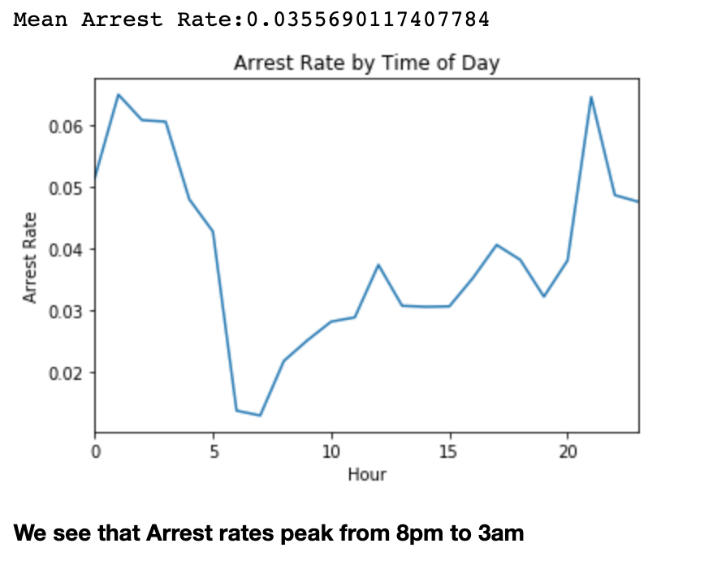
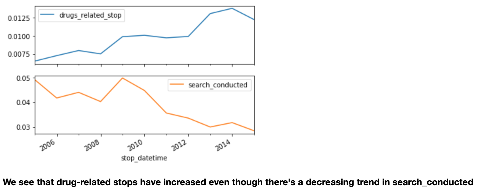
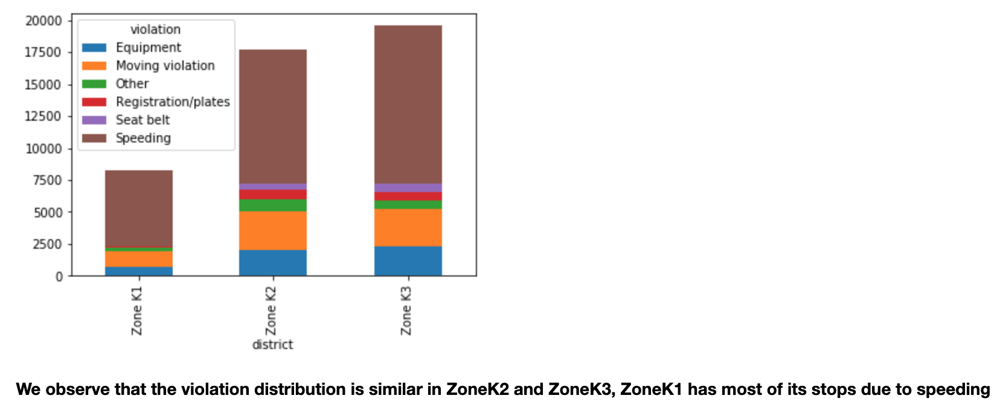
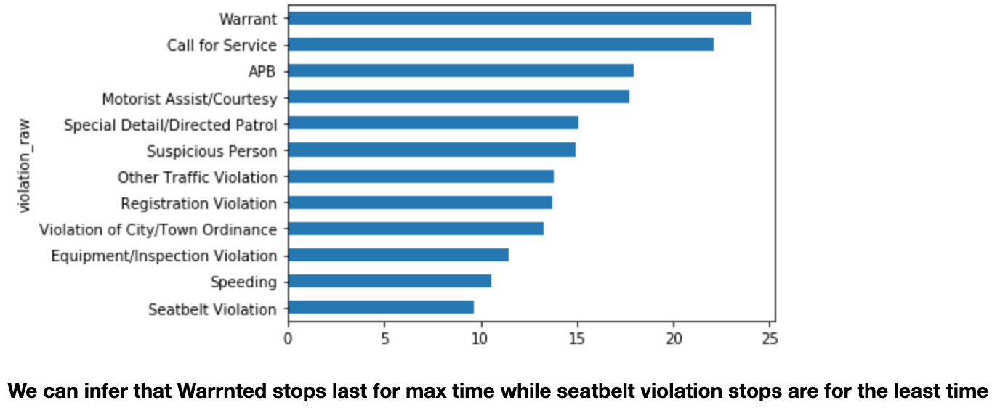
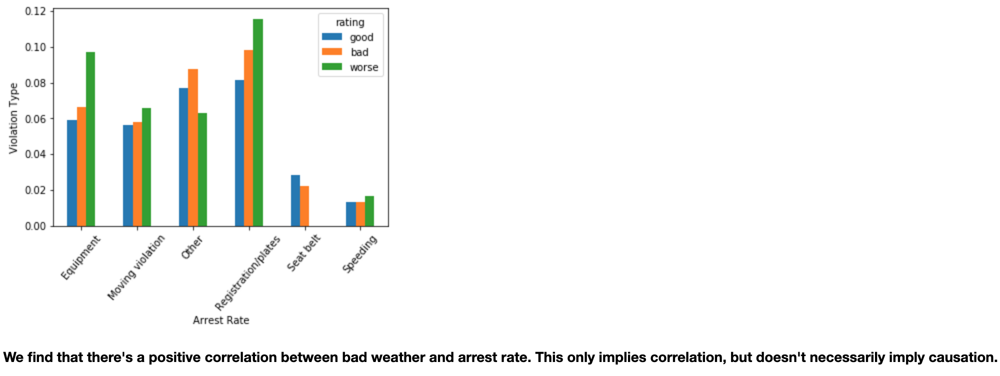

# Analyzing-Police-Activity
Analyzed the Stanford Open Policing Data to demonstrate various insights on people pulled over by police in the state of Rhode Island. The project aims to answer questions and find relationship between policing and race, gender, weather conditions, district among other parameters.

### How does arrest rate vary during different times in a day?

### Have drug-related stops increased over the years?

### What is the violation distribution in different districts?

### How long is one likely to be stopped for different kinds of violation?

### Relation between weather at the place of traffic violation and arrest

